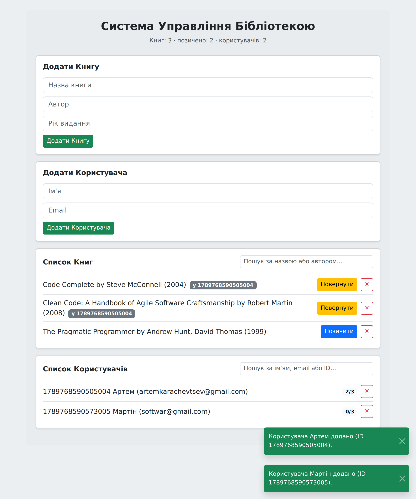
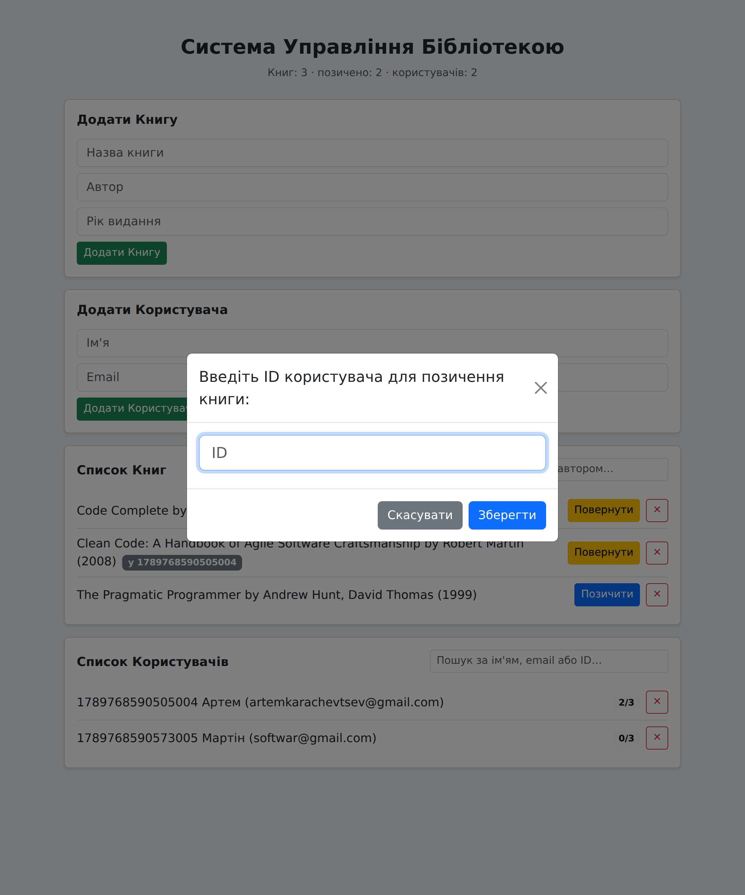

# Лабораторна робота №2 — Система управління бібліотекою

Клієнтський SPA-застосунок для обліку книг і користувачів із операціями позичання/повернення.
Реалізований на **TypeScript** (класи, інтерфейси, generics, модулі, простори імен),
зібраний **webpack** (гілка `main`) та **Vite** (гілка `vite-migration`), стилізований **Bootstrap 5**.

Уся розмітка генерується з коду — у `index.html` немає нічого, крім `<div id="app"></div>`.



---

## Швидкий старт

```bash
npm install          # встановити залежності
npm start            # dev-сервер на http://localhost:9000
npm run build        # продакшн-збірка у dist/
npm test             # юніт-тести (Mocha + Chai)
npm run lint         # ESLint
npm run format       # Prettier
npm run typecheck    # tsc --noEmit без емісії файлів
npm run deploy       # збірка + публікація dist/ на гілку gh-pages
```

Гілка з Vite:

```bash
git checkout vite-migration
npm install
npm start            # той самий порт 9000, той самий застосунок
```

---

## Структура проєкту

```
lab-app/
├── src/
│   ├── models/                 # чисті дані + типи; не знають ні про DOM, ні про storage
│   │   ├── Book.ts
│   │   ├── User.ts
│   │   └── interfaces/
│   │       ├── IBook.ts
│   │       └── IUser.ts
│   ├── services/               # бізнес-логіка; не чіпає DOM
│   │   ├── Library.ts          # generic-клас Library<T> на базі Map
│   │   ├── LibraryService.ts   # позичання/повернення, ліміт, синхронізація зі сховищем
│   │   ├── Storage.ts          # типізована обгортка над LocalStorage
│   │   └── NotificationService.ts
│   ├── utils/                  # чисті допоміжні функції
│   │   ├── validators.ts       # namespace Validation { … }
│   │   └── idGenerator.ts
│   ├── ui/                     # єдиний шар, що працює з DOM
│   │   ├── components/
│   │   │   ├── BookForm.ts
│   │   │   ├── BookList.ts
│   │   │   ├── UserForm.ts
│   │   │   ├── UserList.ts
│   │   │   ├── FormField.ts
│   │   │   ├── Pagination.ts
│   │   │   ├── Modal.ts
│   │   │   └── Toast.ts
│   │   ├── dom.ts              # хелпери створення елементів
│   │   └── render.ts           # кореневий рендерер AppView
│   ├── types/index.ts          # спільні типи, enum-и, константи
│   ├── styles/main.scss        # вибіркове підключення Bootstrap + власні стилі
│   └── index.ts                # точка входу (композиційний корінь)
├── tests/
│   ├── library.test.ts
│   └── validation.test.ts
├── public/favicon.svg
├── index.html                  # тільки <div id="app"></div>
├── webpack.config.js           # гілка main
├── vite.config.ts              # гілка vite-migration
├── tsconfig.json / tsconfig.test.json
├── .eslintrc.json / .prettierrc / .mocharc.json
└── .husky/pre-commit
```

### Принципи розділення

| Шар        | Відповідальність                                        | Що заборонено             |
| ---------- | ------------------------------------------------------- | ------------------------- |
| `models`   | дані книги/користувача, геттери, зміна власного стану    | DOM, LocalStorage         |
| `services` | колекції, бізнес-правила, персистентність                | DOM                       |
| `utils`    | чисті функції: валідація, генерація id                   | стан, DOM                 |
| `ui`       | генерація та оновлення DOM                               | бізнес-правила            |

Виняток — `NotificationService`: за структурою з методички він лежить у `services/`,
але фактично є фасадом над UI-компонентами `Modal` і `Toast`, тож уся робота з DOM
всередині нього делегована в `ui/components/`.

---

## Реалізовані вимоги

| #   | Вимога                                          | Де реалізовано                                        |
| --- | ----------------------------------------------- | ----------------------------------------------------- |
| 2   | жодної розмітки в `index.html`                  | `index.html` містить лише `<div id="app"></div>`      |
| 3   | UI генерується програмно                        | `src/ui/dom.ts`, `src/ui/render.ts`, `ui/components/`  |
| 4–5 | типізація, класи та інтерфейси                  | `strict: true`, `models/`, `interfaces/`               |
| 6   | Generics                                        | `Library<T extends Identifiable>`, `Storage<TDto>`     |
| 7   | модулі та простір імен                          | ES-модулі + `namespace Validation` у `validators.ts`   |
| 9   | Library: додавання/видалення/пошук              | `Library.add/remove/findById/find/filter`              |
| 10  | Storage: зберігання, видалення, очищення        | `Storage.save/load/remove/clear`                       |
| 12  | позичання та повернення                         | `LibraryService.borrowBook/returnBook`, `Book.borrow`  |
| 13  | валідація (обов'язкові, id-цифри, рік-регулярка) | `namespace Validation`                                |
| 14  | сповіщення без `alert`, ліміт 3 книги            | `NotificationService`, `Modal`, `MAX_BORROWED_BOOKS`   |
| 15  | LocalStorage                                    | `Storage` + `LibraryService.persist/load`              |
| 16  | ESLint + Prettier                               | `.eslintrc.json`, `.prettierrc`, 0 попереджень         |
| 17  | Mocha + Chai                                    | `tests/` — 54 тести                                    |
| 18  | Husky pre-commit                                | `.husky/pre-commit`                                    |
| 19  | пошук за автором або назвою                     | `Book.matches`, `LibraryService.searchBooks`           |
| 20  | видалення книг і користувачів                   | `removeBook`, `removeUser` (з каскадним звільненням)   |
| 21  | пагінація по 5                                  | `Library.paginate`, `ui/components/Pagination.ts`      |
| 22  | Vite в окремій гілці                            | гілка `vite-migration`, `vite.config.ts`               |

### Модальні вікна

Замість `alert` / `confirm` / `prompt` використані Bootstrap-модалки,
загорнуті в `Promise`, — виклик читається лінійно:

```ts
const userId = await notifications.prompt({
  title: 'Введіть ID користувача для позичення книги:',
  placeholder: 'ID',
  validate: (value) => Validation.validateUserIdInput(value),
});
```



### Валідація

| Поле           | Правило                                                              |
| -------------- | -------------------------------------------------------------------- |
| Назва, Автор   | обов'язкове, ≥ 2 символів                                            |
| Рік видання    | `^(1\d{3}\|20\d{2}\|21\d{2})$` + діапазон 1450…поточний рік            |
| Ім'я           | обов'язкове, ≥ 2 символів                                            |
| Email          | `^[^\s@]+@[^\s@]+\.[a-zA-Z]{2,}$`, унікальний у межах бібліотеки      |
| ID користувача | обов'язкове, `^\d+$` (тільки цифри)                                  |

Регулярка перевіряє **формат** (рівно чотири цифри в межах 1000–2199), а окрема
перевірка діапазону — **семантику** (не раніше 1450 і не з майбутнього). Розділення
дає користувачу точніше повідомлення: «має складатися з 4 цифр» проти «має бути в межах».

---

## Тестування

```bash
npm test
```

54 тести, згруповані так:

- **`Library<T>`** — `add` (у т. ч. відмова на дублікат id), `remove`, `findById`,
  `find`, `filter`, `has`, `update`, `clear`, незмінність копії з `getAll()`, `paginate`
  (повна сторінка, залишок, вихід за межі діапазону, порожня колекція).
- **`LibraryService`** — позичання, відмова на вже позиченій книзі, ліміт у 3 книги,
  неіснуючий користувач, повернення, каскадне звільнення книг при видаленні користувача,
  пошук, унікальність email, відновлення стану зі сховища.
- **`Validation`** — обов'язкові поля, id тільки з цифр, рік (формат, діапазон, майбутнє),
  email, повні перевірки `validateBook` і `validateUser`.

Тести не залежать від браузера: `Storage` приймає драйвер, і в тестах підставляється
`MemoryStorageDriver`, тож кожен тест стартує з чистого сховища.

## Husky

`.husky/pre-commit` послідовно запускає `npm run lint` і `npm test`.
Ненульовий код виходу будь-якої перевірки скасовує коміт:

```
▶ ESLint…
✖ Unexpected any. Specify a different type  @typescript-eslint/no-explicit-any
✖ ESLint знайшов помилки — коміт скасовано.
husky - pre-commit script failed (code 1)
```

---

## Git-процес

Робота велася за **feature branch workflow**: кожна логічна частина — окрема гілка,
що вливається в `main` через merge-коміт (`--no-ff`), із повідомленнями за
[Conventional Commits](https://www.conventionalcommits.org/):

```
feat/build-setup      build: налаштувати webpack, ts-loader та dev-server на порту 9000
feat/models           feat(models): додати класи Book і User з інтерфейсами IBook та IUser
feat/validation       feat(validation): реалізувати namespace Validation з правилами форм
feat/library-service  feat(services): реалізувати generic-клас Library<T> на базі Map
feat/ui               feat(ui): додати списки з пошуком і пагінацією по 5 записів
test/unit-tests       test(library): покрити додавання, видалення, пошук і позичання
chore/husky           chore(husky): блокувати коміт, якщо ESLint або Mocha не пройшли
vite-migration        build: замінити webpack на Vite (dev-сервер, збірка, TS та SCSS)
```

## Деплой на GitHub Pages

```bash
npm run deploy      # webpack-збірка з main
```

Скрипт виконує `npm run build` і публікує `dist/` на гілку `gh-pages` пакетом `gh-pages`.
Для версії на Vite — те саме з гілки `vite-migration`. У `vite.config.ts` заданий
`base: './'`, а в webpack — `output.publicPath: ''`, тому шляхи відносні й сайт
працює з підкаталогу `https://<user>.github.io/<repo>/`.

---

# Висновок: webpack проти Vite на цьому проєкті

Обидві конфігурації писалися з нуля за офіційною документацією й дають функціонально
ідентичний застосунок: той самий `index.html`, та сама точка входу `src/index.ts`,
той самий порт 9000, та сама директорія `dist/`. Заміри нижче зроблені на одній
машині (Node 22, Linux), по 3 прогони на кожен показник, кеші (`node_modules/.cache`,
`node_modules/.vite`) очищалися перед кожним запуском.

## Цифри

| Показник                              | webpack 5              | Vite 5                 | Різниця          |
| ------------------------------------- | ---------------------- | ---------------------- | ---------------- |
| Холодний старт dev-сервера            | **7.27 / 7.36 / 7.38 с** | **0.58 / 0.59 / 0.60 с** | ≈ у 12 разів     |
| Продакшн-збірка                       | **8.04 / 8.07 / 8.34 с** | **3.93 / 3.98 / 4.03 с** | ≈ у 2 рази       |
| JS у `dist` (сирий)                   | 49.5 KB                | 53.8 KB                | +9 % у Vite      |
| JS у `dist` (gzip)                    | **14.9 KB**            | 15.7 KB                | +5 % у Vite      |
| CSS у `dist` (gzip)                   | 23.3 KB                | **23.0 KB**            | −1 % у Vite      |
| Рядків конфігурації                   | ≈ 130                  | **≈ 67**               | удвічі менше     |
| Пакетів у `devDependencies` для збірки | 9                      | **1**                  | −8               |

## Швидкість старту dev-сервера та HMR

Головна різниця — архітектурна, а не в «оптимізованості». webpack перед першим
запитом збирає весь граф модулів у бандл: 50 модулів проєкту плюс Bootstrap
і його Sass. Звідси стабільні ~7.3 с до першої відповіді на `localhost:9000`.

Vite у dev не бандлить взагалі: він піднімає сервер за ~0.6 с і віддає модулі
браузеру як нативний ESM, транспілюючи кожен файл esbuild-ом на льоту при запиті.
Тому чесніше казати не «Vite у 12 разів швидший», а «Vite переносить роботу
з моменту старту на момент першого запиту сторінки»: перше завантаження в браузері
відчутно повільніше за друге, поки прогрівається кеш залежностей у `node_modules/.vite`.
Для проєкту такого розміру сумарно все одно виграє Vite, але розрив уже не
дванадцятикратний.

HMR: у webpack гаряча заміна після правки одного `.ts` займала помітну паузу —
перезбирається чанк, у який потрапив модуль. У Vite оновлюється рівно один модуль,
і правка в `BookList.ts` видно в браузері практично миттєво. На цьому проєкті
різниця не критична, але на кодовій базі в сотні модулів вона стає визначальною.

## Час і складність налаштування

webpack-конфіг — ~130 рядків, і кожен loader треба поставити й описати самому:
`ts-loader`, `css-loader`, `style-loader`, `sass-loader`, `mini-css-extract-plugin`,
`html-webpack-plugin`, плюс `asset/resource` для шрифтів і зображень. Окремо
довелось розібратись, що `style-loader` потрібен у dev, а `MiniCssExtractPlugin.loader` —
у production, і що `html-webpack-plugin` необхідний навіть при єдиному HTML-файлі.

vite-конфіг — ~67 рядків, і більша частина з них — не «щоб запрацювало», а тонке
налаштування виводу (`entryFileNames`, `manualChunks`, `base`). TypeScript і SCSS
працюють без жодного рядка конфігурації: достатньо, щоб `sass` був у залежностях.
Вартість входу для новачка у Vite відчутно нижча.

Розплата за це — дві неочевидні дрібниці, яких у webpack немає:

1. У `index.html` доводиться додати `<script type="module" src="/src/index.ts">`:
   Vite бере точку входу з HTML, а не з конфігу.
2. Vite попереджає `The CJS build of Vite's Node API is deprecated`. Прибрати його
   можна лише додавши `"type": "module"` у `package.json`, але тоді ламається
   зв'язка Mocha + `ts-node` у CommonJS-режимі, тому попередження свідомо залишене.

## Розмір і швидкість продакшн-збірки

У продакшні обидва інструменти йдуть через Rollup-подібний пайплайн (Vite — буквально
через Rollup) і дають практично однаковий результат: різниця в gzip — менше кілобайта.
CSS ідентичний з точністю до пари сотень байт, бо його генерує один і той самий Sass
з одного й того самого `main.scss`.

Невелику перевагу webpack у розмірі JS дає `runtimeChunk: 'single'` і трохи агресивніший
Terser; Vite натомість збирає за ~4 с проти ~8 с. На такому обсязі це не має значення,
але на CI з десятками збірок на день різниця у 4 с × N уже помітна.

Обидві збірки перевірені однаковим браузерним сценарієм (25 перевірок: валідація,
позичання, ліміт у 3 книги, пошук, пагінація, збереження після перезавантаження,
каскадне видалення) — обидві проходять його повністю, без помилок у консолі.

## Підключення UI-фреймворку та TS-лоадерів

Bootstrap підключається як npm-залежність в обох випадках, але шлях різний:

- **webpack**: `sass-loader` → `css-loader` → (`style-loader` у dev / `MiniCssExtractPlugin`
  у prod). Три пакети й гілка `isProduction ? … : …` у конфігу.
- **Vite**: `import './styles/main.scss'` — і все. Розділення на dev/prod внутрішнє.

TypeScript: `ts-loader` робить повну перевірку типів під час збірки, тож помилка типу
валить `npm run build`. Vite використовує esbuild, який **типи не перевіряє взагалі** —
лише зрізає анотації. Це і дає прискорення, і створює ризик: зібрати код із помилкою
типів цілком можливо. Тому в проєкті є окремий скрипт `npm run typecheck` (`tsc --noEmit`),
і на гілці з Vite він обов'язковий у CI, тоді як на webpack-гілці він радше дублює збірку.

## Екосистема плагінів

webpack старший, і під нього існує плагін майже під будь-яку задачу; документація
й відповіді на StackOverflow покривають найекзотичніші випадки. Мінус — велика частина
матеріалів написана під webpack 4, а API 5-ї версії місцями відрізняється.

Vite сумісний із плагінами Rollup, чого для типового SPA більш ніж достатньо, а
офіційні пресети (`@vitejs/plugin-*`) закривають React/Vue/legacy-браузери. Для
нестандартної інтеграції зі старим тулінгом webpack усе ще має ширший вибір.

## Суб'єктивна оцінка

Для невеликого SPA на кшталт цього **Vite зручніший**: менше конфігурації, менше
залежностей (1 проти 9), миттєвий старт і HMR, удвічі швидша збірка при тому самому
розмірі бандла. Головна поступка — відсутність перевірки типів під час збірки, що
закривається окремим кроком `tsc --noEmit`.

webpack виправданий там, де потрібен повний контроль над пайплайном: нетипові
loader-и, складне розбиття чанків, інтеграція зі старою інфраструктурою або
вимога, щоб збірка падала на помилках типів без додаткових кроків. Для навчального
проєкту він корисний тим, що змушує зрозуміти, з чого взагалі складається збірка —
Vite ці етапи ховає.

---

## Контрольні питання

**1. Переваги TypeScript перед JavaScript у великому застосунку.**
Помилки ловляться під час компіляції, а не в рантаймі у користувача: у цьому проєкті
`strict: true` не дав би звернутися до `book.borrowedBy` без перевірки на `null`.
Типи працюють як документація, що не старіє, і дають надійний рефакторинг — перейменування
методу `Library` одразу підсвічує всі місця виклику. Автодоповнення в IDE знає структуру
`BookDto` без заглядання в код.

**2. Різниця між класом та інтерфейсом.**
Клас — це і тип, і реалізація: він існує в скомпільованому JS і створює об'єкти.
Інтерфейс існує лише на етапі компіляції й зникає після збірки. Інтерфейс доречний,
коли потрібен контракт без реалізації: `IBook` дозволяє UI залежати від набору
властивостей і методів, а не від конкретного класу `Book` — модель можна замінити
на іншу реалізацію, не чіпаючи компоненти.

**3. Generics і навіщо вони в `Library`.**
Generics параметризують тип, з яким працює структура. `Library<T extends Identifiable>`
керує і книгами, і користувачами одним кодом, зберігаючи точну типізацію:
`books.findById(id)` повертає `Book | undefined`, `users.findById(id)` — `User | undefined`.
Без generics довелося б або писати два майже однакові класи (`BookLibrary`, `UserLibrary`),
або зробити колекцію по `object`/`any` — і тоді кожен виклик потребував би приведення
типу, а всі помилки виявлялися б у рантаймі.

**4. ES-модулі проти namespace.**
Модуль — це файл: він має власну область видимості, явні `import`/`export`, і бандлер
уміє відкидати невикористані експорти (tree-shaking). Namespace — це іменований об'єкт
усередині одного файлу; історично він розв'язував ту саму задачу до появи ES-модулів.
Сьогодні namespace доречний саме як логічне групування всередині модуля: у
`validators.ts` він збирає регулярки, тексти помилок і функції під одним іменем
`Validation.*` замість десятка дрібних окремих експортів.

**5. Модульна структура й відповідальність шарів.**
`models` — дані та власний стан сутності, без знання про DOM і сховище, що робить їх
тривіальними для тестування. `services` — колекції, бізнес-правила й персистентність,
без жодного звернення до DOM. `utils` — чисті функції без стану. `ui` — єдиний шар,
який торкається DOM. Залежності спрямовані в один бік: `ui → services → models`,
зворотних імпортів немає.

**6. Storage і LocalStorage.**
`Storage<TDto>` серіалізує масив DTO у JSON і кладе під власним ключем
(`library-app:books`, `library-app:users`). При старті `LibraryService.load()` читає
масиви й відновлює екземпляри через `Book.fromJSON` / `User.fromJSON`; після кожної
зміни викликається `persist()`. Пошкоджений JSON не валить застосунок — запис
видаляється, повертається порожній масив. Обмеження LocalStorage: близько 5 МБ на
походження, тільки рядки (усе інше через JSON), синхронний API, що блокує головний
потік, відсутність доступу з Web Worker, і повна недоступність у приватному режимі
деяких браузерів — саме тому передбачено запасний `MemoryStorageDriver`.

**7. Логіка borrow / return.**
`borrowBook(bookId, userId)` послідовно перевіряє: чи існує книга, чи існує користувач,
чи книга не позичена, чи не вичерпано ліміт. Лише після всіх перевірок id книги
додається до `Set` користувача, а `book.borrow(userId)` переводить книгу зі стану
`Available` у `Borrowed` і записує `borrowedBy`. `returnBook(bookId)` робить зворотне:
знімає книгу зі списку користувача й повертає статус `Available`, обнуляючи `borrowedBy`.
У UI це видно одразу: кнопка «Позичити» змінюється на «Повернути», поруч зʼявляється
бейдж із id власника, а лічильник користувача росте `1/3 → 2/3`.

**8. Валідація форм і регулярка року.**
Форми збирають сирі рядки й передають їх у `Validation.validateBook` /
`validateUser`, які повертають `{ valid, errors }` — мапу «поле → текст помилки»;
компонент підсвічує поле й малює текст під ним. Рік перевіряється в три кроки:
`^\d+$` (тільки цифри) → `^(1\d{3}|20\d{2}|21\d{2})$` (рівно чотири цифри у розумних
межах) → числове порівняння з `1450` і поточним роком. Кожен крок дає власне
повідомлення, тож користувач бачить конкретну причину, а не загальне «некоректний рік».

**9. Обмеження на кількість позичених книг.**
`MAX_BORROWED_BOOKS = 3`. Перевірка живе в моделі: `User.canBorrow()` порівнює розмір
`Set` позичених id з константою, а `addBorrowedBook` додатково страхує від перевищення.
При спробі позичити четверту книгу `LibraryService` повертає
`{ ok: false, reason: LimitReached }`, і UI показує саме модальне вікно (а не toast):
«Користувач N вже позичив 3 книги. Поверніть одну з них, щоб позичити нову».

**10. Чому заборонена розмітка в index.html.**
Мета — показати, що інтерфейс є функцією від стану, а не статичним HTML. Якщо структура
описана в розмітці, то список книг доводиться синхронізувати вручну, і легко отримати
розходження між станом і DOM. У цьому проєкті `AppView.mount()` один раз будує каркас
через `el()` (обгортка над `document.createElement`), а `refresh()` перемальовує лише
вміст списків через `replaceChildren`. Побічна перевага: текст скрізь виставляється
через `textContent`, а не `innerHTML`, тому назва книги з `<script>` всередині
не може виконатись.

**11. За що відповідає webpack.config.js.**
Описує весь пайплайн збірки. Самостійно налаштовано: `entry: './src/index.ts'` —
точка входу; `output` — директорія `dist`, імена з `[contenthash]` для кешування,
`clean: true`; `module.rules` — `ts-loader` для `.ts`, ланцюжок
`sass-loader → css-loader → style-loader/MiniCssExtractPlugin` для стилів,
`asset/resource` для шрифтів і зображень; `devServer` — порт 9000, `hot: true`,
статика з `public/`; `optimization.splitChunks` — окремий чанк для залежностей.

**12. Роль ESLint і Prettier.**
Prettier відповідає за форматування — відступи, лапки, довжину рядка; він не знає
про семантику коду й просто переписує його за єдиним стилем. ESLint аналізує код:
знаходить невикористані змінні, `any`, відсутні типи повернення, порівняння через `==`
і навіть заборонений умовою `alert` (правило `no-alert`). Prettier відповідає на питання
«як це виглядає», ESLint — «чи це правильно». Вони інтегровані через
`plugin:prettier/recommended`, тож конфлікти правил вимкнені, а розходження
з форматуванням ESLint показує як помилку.

**13. Що тестують юніт-тести.**
Для `Library` — контракт колекції: додавання (у т. ч. відмову на дублікат id),
видалення неіснуючого елемента, пошук за id і за предикатом, незмінність внутрішнього
стану при роботі з копією, пагінацію на межах діапазону. Для `Validation` — кожне
правило окремо. Приклад тест-кейсу:

```ts
it('не додає дублікат за id і повертає false', () => {
  const library = new Library<Book>([makeBook('b1')]);
  const added = library.add(makeBook('b1', 'Інша назва'));

  expect(added).to.equal(false);
  expect(library.size).to.equal(1);
  expect(library.findById('b1')?.title).to.equal('Clean Code');
});
```

**14. Як працює Husky pre-commit.**
Husky прописує `core.hooksPath = .husky/_`, і git починає брати хуки звідти.
Перед кожним комітом запускається `.husky/pre-commit`, який послідовно виконує
`npm run lint` і `npm test`; будь-який ненульовий код виходу скасовує коміт.
У командній розробці це прибирає цілий клас проблем: у спільну гілку фізично не
потрапляє код, що не проходить лінтер або ламає тести, тож CI не червоніє через
дрібниці, а рев'ю не витрачається на обговорення відступів.

**15. Основні відмінності webpack і Vite за результатами порівняння.**
Dev-сервер: 7.3 с проти 0.6 с — webpack збирає бандл перед стартом, Vite віддає
нативні ES-модулі й транспілює їх на вимогу. Конфігурація: ~130 рядків і 9 пакетів
проти ~67 рядків і 1 пакета — TypeScript і SCSS у Vite працюють «з коробки».
Продакшн-збірка: 8.1 с проти 4.0 с при практично однаковому розмірі — різниця
в gzip менша за кілобайт, бо обидва в підсумку йдуть через Rollup-подібний пайплайн.
Головний компроміс Vite — esbuild не перевіряє типи, тож потрібен окремий
`tsc --noEmit`.
